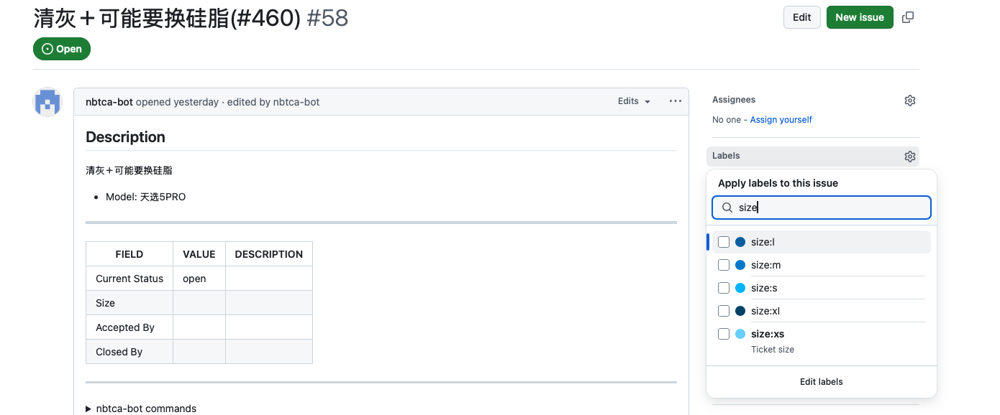

# 维修工单系统 (weekend)

:::info 维护信息

| 维护人        | 时间            |
| ------------- | --------------- |
| @wen-templari | 2025.4.21 - now |

:::

## 总览

```mermaid

flowchart LR
    S[sunday] --> L[logto]
    S --> Sa[saturday]
    H[hawaii] --> Sa
    Sa --> L
    L --> |webhook| Sa
    Sa --> D[(Database)]
    Sa --> G[Github]
    G --> |webhook| Sa
    Sa --> N[nsq]

```

| 地址                                 | 仓库                                                | 描述                       |
| ------------------------------------ | --------------------------------------------------- | -------------------------- |
| <https://repair.nbtca.space/api>     | [nbtca/saturday](https://github.com/nbtca/saturday) | 后端                       |
| <https://repair.nbtca.space>         | [nbtca/sunday](https://github.com/nbtca/sunday)     | 管理页面                   |
| NA                                   | [nbtca/hawaii](https://github.com/nbtca/hawaii)     | 微信小程序，用于报修       |
| <https://auth-admin.app.nbtca.space> | [logto-io/logto](https://github.com/logto-io/logto) | 鉴权                       |
| NA                                   | [nsqio/nsq](https://github.com/nsqio/nsq)           | 消息队列，用于推送维修事件 |

## 角色

| 角色名 | 权限描述                             |
| ------ | ------------------------------------ |
| client | 创建维修事件，取消事件               |
| member | 接受维修事件，提交维修描述，放弃事件 |
| admin  | 审核维修描述，关闭事件, 添加member   |

### 维修人员基本信息

为了管理员验证成员身份，以及后续申报志愿者时长，需要收集成员的个人信息。

| 字段名    | 描述     |
| --------- | -------- |
| member_id | 学号     |
| name      | 真实姓名 |
| phone     | 手机号   |
| qq        | QQ号     |

## 维修事件

```mermaid
flowchart LR
    A[Open] --> |Drop| B[Canceled]
    A --> |Accept| C[Accepted]
    C --> |Commit| D[Commited]
    D --> |AlterCommit| D
    D --> |Approve| E[Closed]
    D --> |Reject| C
```

### 事件状态(status)

| 状态名 | status    | 描述                                 |
| ------ | --------- | ------------------------------------ |
| 待处理 | open      | 维修事件未被成员接受                 |
| 取消   | cancelled | 维修事件被用户取消，不需要再进行处理 |
| 受理   | accepted  | 维修事件已被成员接受                 |
| 待审核 | committed | 成员提交了维修描述，管理员尚未审核   |
| 关闭   | closed    | 维修事件已解决，不能再更改该事件     |

### 事件行为(action)

| 操作名   | action      | 操作权限       | 事件状态变更           | 描述                                         |
| -------- | ----------- | -------------- | ---------------------- | -------------------------------------------- |
| 创建     | create      | client         | nil => open            | 用户创建了维修事件                           |
| 受理     | accept      | member         | open => accepted       | 成员接受了维修事件                           |
| 取消     | cancel      | current client | open => canceled       | 用户取消了自己创建的维修事件                 |
| 放弃     | drop        | current member | accept => open         | 成员放弃了自己接受的维修事件                 |
| 提交     | commit      | current member | accept => committed    | 成员维修完成，添加维修描述后提交给管理员审核 |
| 修改提交 | alterCommit | current member | committed => committed | 成员修改 未被审核的维修提交                  |
| 拒绝提交 | reject      | admin          | committed => accepted  | 管理员拒绝提交                               |
| 关闭     | close       | admin          | committed => closed    | 管理员通过提交                               |

## 在Github上处理维修

```mermaid
sequenceDiagram
    participant Saturday
    participant Github
    Saturday->>+Github: Create Issue
    Note right of Github: On Event Create
    Github->>-Saturday: Issue Id
    Github->>+Saturday: Comment Event (webhook)
    Note right of Github: On Issue Update, Find event by issue id
    Saturday->>-Github: Create Comment

```

目前，新的维修事件会同步到 [Github Issue](https://github.com/nbtca/repair-tickets/issues) 中。成员可以在Github Issue中处理维修事件。

### 前提条件

在开始之前，你需要先关联你的Github账户。你可以前往 [MyId](https://myid.app.nbtca.space/account/connections) 关联你的Github账户。


### 处理事件

在Github Issue中，可以通过在回复中包含以下命令来处理事件：

- `@nbtca-bot accept` will accept this ticket
- `@nbtca-bot drop` will drop your previous accept
- `@nbtca-bot commit` will submit this ticket for admin approval
- `@nbtca-bot reject` will send this ticket back to assignee
- `@nbtca-bot close` will close this ticket as completed


### 记录事件工作量

通过在Github Issue中添加标签来记录工时。


| 标签名    | 对应时长 | 示例维修任务（仅供参考）                        | 场景说明                                         |
| --------- | -------- | ----------------------------------------------- | ------------------------------------------------ |
| `size:xs` | 0.5 小时 | 重启系统、插拔键鼠、调整BIOS启动项              | 无需工具，仅简单排查或软件层级操作               |
| `size:s`  | 1 小时   | 更换键盘、电源适配器、内存条                    | 简单拆装部件，操作快，风险低                     |
| `size:m`  | 2 小时   | 拆机清灰、重新安装操作系统、驱动修复            | 需基本工具、一定技术判断，时间较长               |
| `size:l`  | 4 小时   | 主板故障检测与更换、电源模块更换                | 较复杂的拆装和测试流程，需熟练技能、多人协作可能 |
| `size:xl` | 8 小时   | 批量电脑检修（5 台以上）、全室网卡/主板统一更换 | 工作量极大，涉及多个设备，需团队作业和详细记录   |


### 志愿者时长统计

```typescript
type Record = {
  studentId: string;
  eventId: string;
  tag: string; // e.g., "size:s"
};

const BASE_TIME = 2; // hours
const MAX_TIME = 8;  // hours

// Mapping from tag to time in hours
const tagTimeMap: Record<string, number> = {
  'size:s': 1,
  'size:m': 2,
  'size:l': 4,
  'size:xl': 8,
};

// Compute total time for a given student and event
function calculateTime(records: Record[], studentId: string): number {
  const relevantRecords = records.filter(
    (r) => r.studentId === studentId
  );

  let totalTime = BASE_TIME;

  for (const record of relevantRecords) {
    const time = tagTimeMap[record.tag] || 0;
    totalTime += time;
  }

  return Math.min(MAX_TIME, totalTime);
}


const records: Record[] = [
  { studentId: '2333333333', eventId: '123456', tag: 'size:s' },
  { studentId: '2333333333', eventId: '123456', tag: 'size:m' },
];
const time = calculateTime(records, '2333333333');
console.log('Calculated time:', time); // Output: 5

```

| Key            | Value     | Description              |
| -------------- | --------- | ------------------------ |
| 基础时长       | 2         | 每个志愿者的基础时长     |
| 最高时长       | 8         | 每个志愿者的最高申报时长 |
| 上一次统计日期 | 2025.4.21 | 上一次统计时长的日期     |

统计时长时，获取自从上一次统计日期以来的维修记录，统计完成后将上一次统计日期更新为当前日期。
时长计算参考以上代码中的 `calculateTime` 函数。

#### 例子

| 学号       | 事件ID | size   |
| ---------- | ------ | ------ |
| 2333333333 | 123456 | size:s |
| 2333333333 | 123456 | size:m |

计算后时长为 min(8， 2 + 1 + 2) = 5。

#### 使用Saturday API导出时长为excel

| 字段名       | 描述                 |
| ------------ | -------------------- |
| start_time   | 开始时间             |
| end_time     | 结束时间             |
| bearer_token | token，需要admin权限 |

```http
GET https://repair.nbtca.space/api/events/xlsx?start_time={{start_time}}&end_time={{end_time}}
Authorization: {{bearer_token}}
```

##### 示例
```bash
curl -X GET "http://repair.nbtca.space/api/events/xlsx?start_time=2025-01-01&end_time=2025-05-31" \
  -H "Authorization:  {{bearer_token}}" \
  -OJ
```